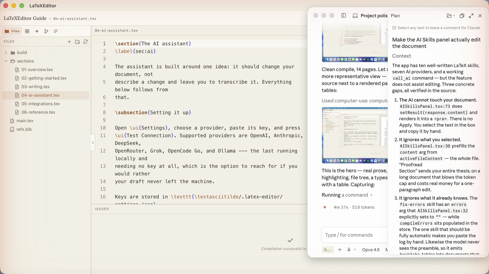
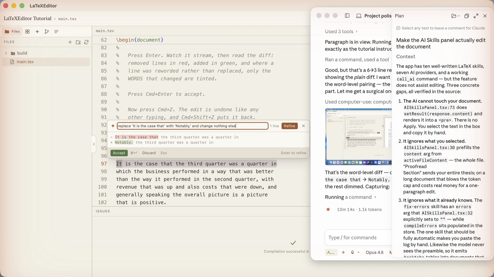
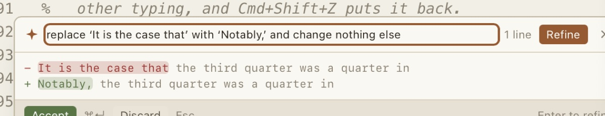
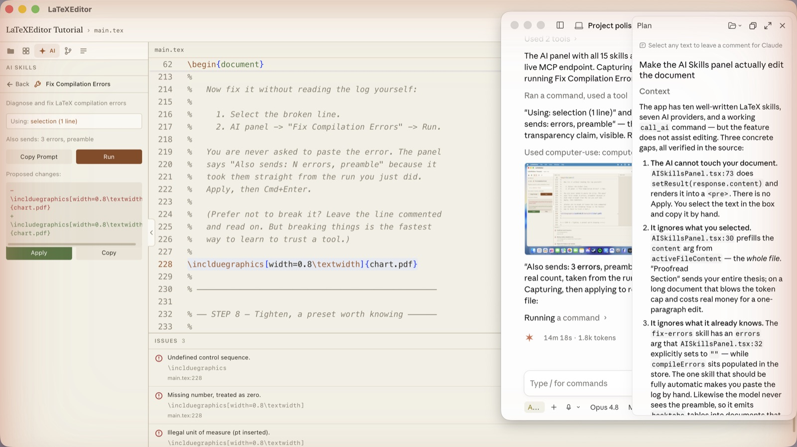
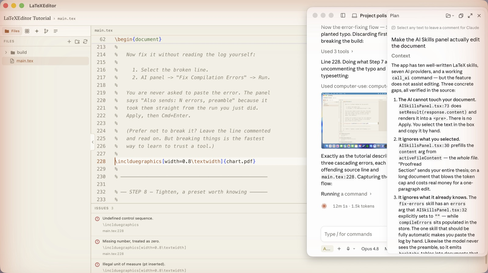
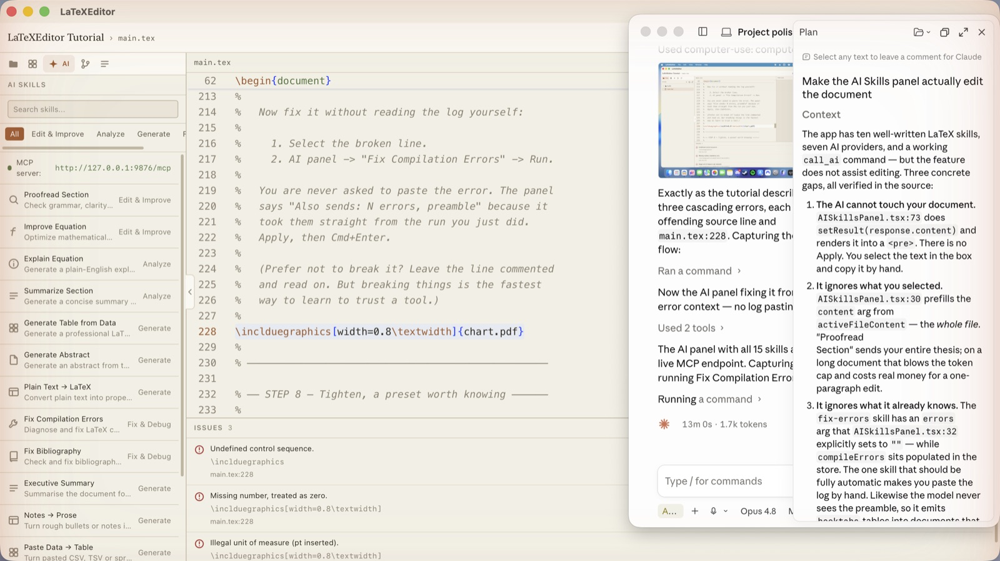
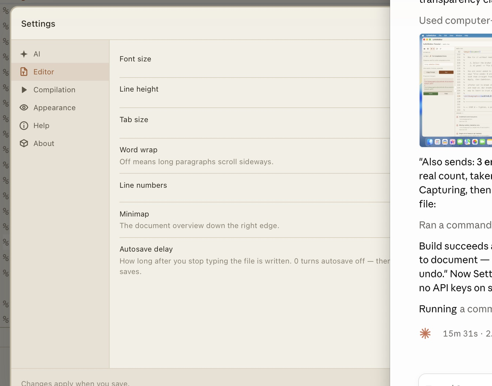

# LaTeXEditor

**A desktop LaTeX editor where the AI edits your document instead of describing
the edit.**

Version 0.1.0 · macOS, Linux, Windows · Tauri + React + Monaco · your files stay
on your machine

---

Most editors bolt a chat window onto the side. You ask for a better paragraph,
it prints one, and you copy it across by hand — reformatting as you go, hoping
you did not drop a `\label` on the way.

This one works the other way round. Put your cursor in a paragraph, press
**⌘K**, say what you want, and read a diff that shows you exactly which words
changed. Press **⌘↵** and it is in your document — in the exact range it came
from. Press **⌘Z** and it never happened.

That is the whole idea. Everything below follows from it.



*Source on the left, typeset PDF on the right, issues underneath. The document
shown is the built-in reference guide — itself a LaTeXEditor project.*

---

## Highlights

### Write without leaving the paragraph

⌘K opens a bar under the text you are standing in. No selection needed: it takes
the paragraph around your cursor, bounded by blank lines *and* `\begin`/`\end`,
so pressing it inside a table body edits the row rather than swallowing the
environment.

Type an instruction, or click a preset. Then:

| Key | What it does |
|---|---|
| `Enter` | Refine — *shorter*, *less formal*, *keep the technical terms* |
| `⌘↵` | Accept, writing back into the captured range |
| `Esc` | Discard, or stop a run in flight |



Refinements re-run against the **original** text, not the previous answer. Ask
for "shorter" three times and you get three attempts at the same task, not a
paragraph whittled away to nothing.

### Diffs you can actually read

A line diff shows a one-word fix as a whole line deleted and a whole line added,
and leaves you to spot the difference. So where a line was reworded rather than
replaced, only the changed words are tinted:



Everything unchanged is dimmed. Your eye goes straight to the edit instead of
re-reading the sentence to find it.

Pairing happens only where it helps. Lines that share no wording, or whose
changes are scattered across many runs, stay as plain line pairs — a word diff
there is confetti. That judgement is measured, not guessed: the heuristic counts
*change runs and surviving anchor words*, because the obvious metric
(percentage of characters changed) gets real edits backwards in both directions.

### It already knows your project

You are never asked to paste a log, or told to check whether a package is
loaded. Each skill declares what it needs and the editor attaches it:

- **Your preamble**, so generated code cannot use `\toprule` in a document that
  never loaded `booktabs`.
- **Your `\label`s and `.bib` keys**, so a suggested citation names a key you
  actually have instead of inventing `smith2019`.
- **Your compile errors**, straight from the last build. *Fix Compilation
  Errors* reads them itself.



The panel states what it is about to send — *selection (1 line)* or *whole file
(299 lines)*, plus *Also sends: 3 errors, preamble* — so the cost is never
hidden. Those three errors came straight from the failed run; nobody pasted a
log.

### Fast enough to use mid-sentence

Skills work on short passages, where a model that deliberates first costs
multiples of the latency for the same edit. Proofreading one section, identical
text and prompt:

| Configuration | Time |
|---|---|
| `deepseek-v4-pro` | 150 s |
| `deepseek-v4-flash` | 45 s |
| `deepseek-v4-flash`, deliberation off | **6 s** |

Twenty-five times faster, same quality of edit. Both settings that get you there
are on by default, and both are yours to change.

### Typesetting that finds your compiler

⌘↵ compiles locally. The backend locates the *root* `.tex` — the one with
`\documentclass` — rather than compiling whichever file happens to be open,
writes to `build/`, and parses the log into errors, warnings and badboxes.
Click an issue and the editor opens that file on that line.



*One bad command throws LaTeX off and everything after it complains. Fix the
first error and the rest usually vanish — the tutorial walks you through exactly
this.*

Compiler discovery deliberately does not trust `PATH`. A macOS app launched from
the Dock inherits roughly `/usr/bin:/bin:/usr/sbin:/sbin`, so a TeX install that
works perfectly in your terminal is invisible to a bundled app. It also checks
`/Library/TeX/texbin`, Homebrew, MacPorts, `~/.local/bin` and versioned TeX Live
trees — and hands the compiler's own directory down to the child process, since
`latexmk` shells out to `pdflatex` in turn.

### A preview worth reading

Pages render at your display's true pixel density, so zooming in reveals detail
rather than magnifying blur. Zoom with the −/+ buttons, with ⌘+ / ⌘− / ⌘0 while
the pointer is over the preview, or by pinching — which zooms continuously and
keeps the point under your pointer still, so you can zoom into a figure by
pointing at it.

**Fit width** and **Fit page** are modes, not one-off calculations: drag the
splitter and the page re-fits.

### Fifteen skills, several of them for reports

Beyond the paper-shaped ones (abstracts, equations, bibliographies): **Executive
Summary**, **Notes → Prose**, **Paste Data → Table** (give it raw CSV or
spreadsheet rows — it escapes the `%` signs that would otherwise comment out
half your table), **Tighten**, and **Consistency Check** for terminology and
tense that drift across a long document.



Skills are typed by what they produce, so the UI matches: rewrites are diffed
and applied, generated blocks insert at the cursor, and explanations are
copy-only — no misleading Apply button on an explanation.

### Let an agent work on it too

A Model Context Protocol server runs on `127.0.0.1:9876`, exposing the open
project and active file to an external coding agent — for the open-ended jobs a
single skill is the wrong shape for, like restructuring a document across
files.

```sh
claude mcp add --transport http latex http://127.0.0.1:9876/mcp
```

It is localhost-only and unauthenticated, and `write_file` overwrites without
asking. Commit before letting an agent loose, and the review is a `git diff`
rather than an act of faith.

---

## What people use it for

### Writing a report against a deadline

You have notes, a spreadsheet of numbers, and four hours. Paste the bullets into
**Notes → Prose** and get paragraphs that say only what your notes said — where
a note is too vague to write from, it leaves a `% TODO:` rather than inventing a
finding. Paste the spreadsheet rows into **Paste Data → Table** and get a
`booktabs` table with the percent signs escaped. Write the **Executive Summary**
last, from the finished document, because that is when you actually know the
conclusion. Run **Tighten** on the section that ran half a page over.

### Cleaning up a draft you already wrote

⌘K, *make this clearer*, read the diff, accept or move on. On prose you have
already revised twice, expect it to propose preferences and expect to decline
most of them — that is what running a copy-editor over clean copy looks like.
The word-level diff is what makes declining cheap: you can see in a glance that
a change is a serial comma rather than a fixed error.

### Getting unstuck on a LaTeX error

Press Typeset, get "Undefined control sequence", click the row, land on the
line. Select it, run **Fix Compilation Errors**. The error is already attached —
you are never asked to find it in a 400-line log. This is the case where the
editor knowing your project pays for itself immediately.

### A thesis or a long, multi-file document

`\input` across chapter files, a `.bib` the AI reads for real citation keys, and
an Outline panel that jumps between headings. Commit as you go from the Git
panel. Compiler discovery means it typesets on a machine where a GUI app would
otherwise claim you have no TeX installed.

### Working with a coding agent

Point Claude Code or any MCP client at `127.0.0.1:9876` and it can read and
write the project you have open — for restructuring across files, renaming a
label everywhere, or splitting a chapter. The skills panel is for one passage
and one diff you approve; an agent is for many files and several steps. Commit
first, and the review is a `git diff`.

### Drafting something you would rather not send anywhere

Point it at **Ollama** and no text leaves the machine. Every feature above works
the same way; the only difference is which endpoint the request goes to.

---

## Fifteen minutes to your first report

First launch offers a hands-on tutorial — nine steps ending in a finished
one-page report. It is one file, and the instructions are `%` comments sitting
directly above the work, so they are visible while you edit and invisible in the
PDF.

Step 7 has you uncomment a planted typo, watch the build fail, and fix it with
the AI without ever reading the log.

You can skip it and open it later from **Settings → Help** or the command
palette. **Start over** restores the pristine copy and renames your current one
to `LaTeXEditor Tutorial (previous 1)` rather than deleting it.

The full reference — sixteen pages, itself written as a LaTeXEditor project —
is one folder over.

---

## Requirements

- **A LaTeX distribution.** TeX Live, MacTeX, or MiKTeX. Without one, editing
  works and typesetting does not — and you get a banner with a Re-check button
  rather than silence.
- **Node.js** and **Rust** (stable) to build from source.
- **An AI provider key**, for the AI features only. OpenAI, Anthropic, DeepSeek,
  OpenRouter, Grok, and OpenCode Go are supported — or **Ollama**, which runs
  locally and needs no key at all, if you would rather your draft never left the
  machine. Keys live in `~/.latex-editor/settings.json`.

## Building it

There are no prebuilt binaries yet; this is a v0.1.0 you compile yourself.

```sh
npm install
npm run dev          # dev build, app window + HMR
npm run tauri:build  # packaged desktop app
npm run install      # build, copy to /Applications, launch (macOS)
npm test             # 22 Rust tests + the src/lib checks
npm run lint
```

> **Gotcha:** `npm run install` is a no-op if the app is already running — it
> copies to `/Applications` and calls `open`, which just focuses the existing
> process, so you keep testing the old binary. The process is named
> `latex-editor`, not `LaTeXEditor`, which is also why `pkill -x LaTeXEditor`
> does not match it.

---

## Settings

Six sections behind a left nav, and every control is wired to something real:

- **AI** — provider, model, keys, test connection, temperature, token cap,
  deliberation.
- **Editor** — font size, line height, tab size, word wrap, line numbers,
  minimap, autosave delay. Set the delay to `0` to turn autosave off and save
  with ⌘S instead. Changes take effect the moment you save, not at next launch.
- **Compilation** — default compiler chosen from those actually detected on your
  machine, typeset-on-save, default preview zoom.
- **Appearance** — a warm, paper-leaning palette in dark and light.
- **Help** — open or restart the tutorial, open the guide.
- **About** — version, compilers found, the MCP server's real bind result,
  settings path, installed skills.



Every setting carries a default, and there is a test asserting that a settings
file written by an older build still loads. Losing someone's API keys because a
preference was added would be an unforgivable upgrade.

---

## Under the hood

```
src/
  components/editor/    Monaco setup, LaTeX grammar, ⌘K assistant, editor-bridge
  components/…          one directory per panel or dialog
  lib/                  pure logic, each with a runnable .check.ts
  stores/useAppStore.ts Zustand — the single source of app state
src-tauri/src/
  latex/                compiler discovery, invocation, log parsing
  commands/             the Tauri command surface, including SSE streaming
  git/  synctex/  mcp/  feature modules
```

Monaco ships no LaTeX grammar, so this defines one. Monaco and the pdf.js worker
are both bundled rather than fetched, so the app works offline.

Panels never touch Monaco directly — they go through `editor-bridge.ts`, which
owns the bundled instance.

**There is no test framework, by choice.** The logic that is easy to get quietly
wrong — the line and word diffs, context extraction, code-fence stripping, SSE
decoding, settings migration — has assert-based checks that run under plain
`node` and `cargo test`. 22 Rust tests and four check files, all green.

### Two hard-won notes for anyone editing this

**The base reset in `index.css` must stay inside `@layer base`.** Unlayered CSS
beats layered CSS in the cascade, so an unlayered `* { padding: 0 }` silently
defeats every Tailwind `p-*` / `m-*` utility in the app — which is exactly what
was happening, app-wide, until it was moved.

**Monaco consumes keystrokes before window listeners see them.** ⌘↵ was bound to
"insert line below" and swallowed, so Typeset did nothing from the editor.
Shortcuts that must work while typing are registered with `editor.addCommand`,
not `window.addEventListener`. Escape is bound the same way but gated on an
`aiAssistOpen` context key, so it closes the ⌘K bar without stealing Escape from
Monaco's own widgets.

---

## Not there yet

Stated plainly, because a feature list that hides its gaps is a sales pitch:

- **No editor tabs.** One file open at a time.
- **Plugins are listed and inspectable, but not executed.** The manager is a
  viewer; treat it as a preview of an interface.
- **SyncTeX** is wired end to end in the backend but not bound to a click in the
  PDF pane, so there is no jump-to-source yet.
- **AI context comes from the open file** — `\label`s in other files of a
  multi-file project are not collected yet (`.bib` keys are, across the project).
- **One AI request at a time.** Cancel targets the single in-flight call.
- **The Issues panel shows `main.tex:0`** for warnings whose line number the log
  parser does not extract, so those rows jump nowhere useful.
- **No prebuilt binaries, no code signing, no CI.**

---

Built with Tauri 2, React 19, Monaco, and pdf.js.
